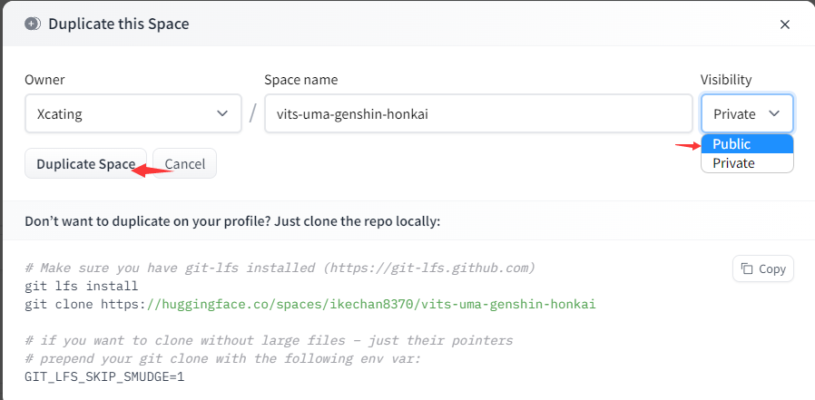

-   \[收集＆编写:鹤望兰]
-   QQ群：559567232
-   如果觉得插件有意思的话请点一个star让作者有更多动力更新！
### 遇到报错优先尝试 #结束全部对话 或者执行 #chatgpt更新来确定你是最新版本
如果问题合集没有你的问题或者无法解决你的问题，请发Issue或进群询问。

## 号外
<details> <summary>每天都要开心点</summary>


</details>


<details> 

<summary>
StarRail-plugin 星穹铁道插件
</summary>

Gitee：

[https://gitee.com/hewang1an/StarRail-plugin](https://gitee.com/hewang1an/StarRail-plugin "https://gitee.com/hewang1an/StarRail-plugin")

Github：

[https://github.com/hewang1an/StarRail-plugin](https://github.com/hewang1an/StarRail-plugin "https://github.com/hewang1an/StarRail-plugin")

和ikechan8370一起写的插件，如果对你有帮助的话点个star吧！

QQ群：758447726 欢迎大佬进群玩

</details>

## 正题

<details> 
<summary>
大佬，你们的电脑都是一直开着的嘛？为什么我一关电脑就用不了了
</summary>
可以挂服务器上，可以去阿里云白嫖七个月
</details>

<details> 
<summary> icqq登陆失败：Token已失效</summary>

可以优先尝试方法一，其他方法为方法一无效时的对应方案！并且所有方法都选择密码登录，并且最后一步选择手机验证码登陆

如果登陆上去的话可以做个小习惯，把data目录里的device.json或者QQ号\_token文件备，喵崽是icqq文件夹备份一个，下次失效的时候直接丢进去就可以了

4.16腾讯开始大规模封查机器人，可以先尝试将icqq版本拉至最新然后在config/config/qq.yaml文件夹里把platform改成6然后node app即可
```纯文本
pnpm install icqq@0.3.1 -w
```
方法一：可以尝试将data目录下的device.json文件删除，windows用户注意将回收站内的一起删除，然后执行npm run login重新验证登录选择ipad＋密码登录

方法二：如果报错误码45且方法一无效的话，请执行npm run login重新验证登录选择MacOS协议登录

方法三：如果报错误码235的话，执行npm run login重新验证选择手表协议登录

方法四：如果报错误码237的话可以降低icqq版本，在云崽根目录下执行
```纯文本
pnpm add icqq@0.0.31 -w
```
&#x20; 或者
```纯文本
pnpm add icqq@0.0.29 -w

```
然后使用方法一进行登录

方法五：如果报错误码238的话使用 npm run login 指令换到手表协议后再用 npm run login 指令换回ipad协议登录

</details>


<details> 
<summary>
发送图片时报错：ppupeteer chromium启动失败
</summary>


方法一：Yunzai目录里执行
```纯文本
pnpm add puppeteer@13.7.0 -w
```
方法二：Yunzai目录里先执行
```纯文本
pnpm install puppeteer@19.7.3 -w
```
再执行
```纯文本
node ./node_modules/puppeteer/install.js
```
等待进度条走完，再重启机器人就可以了

方法三：Yunzai目录里执行下列命令 记得复制完，很长
```纯文本
apt-get install ca-certificates fonts-liberation libasound2 libatk-bridge2.0-0 libatk1.0-0 libc6 libcairo2 libcups2 libdbus-1-3 libexpat1 libfontconfig1 libgbm1 libgcc1 libglib2.0-0 libgtk-3-0 libnspr4 libnss3 libpango-1.0-0 libpangocairo-1.0-0 libstdc++6 libx11-6 libx11-xcb1 libxcb1 libxcomposite1 libxcursor1 libxdamage1 libxext6 libxfixes3 libxi6 libxrandr2 libxrender1 libxss1 libxtst6 lsb-release wget xdg-utils libxkbcommon0 -y
```
</details>
<details> 
<summary>
如何配置反代以及反代地址
</summary>
首先进入锅巴插件 ，点击ChatGPT插件进行配置，将以下各对应反代地址填进你要用的模式

API(openAiBaseUrl): [https://openai-api.ikechan8370.com/v1](https://openai-api.ikechan8370.com/v1 "https://openai-api.ikechan8370.com/v1")或[https://openai-api2.ikechan8370.com/v1](https://openai-api2.ikechan8370.com/v1 "https://openai-api2.ikechan8370.com/v1")或[https://mondstadt.d201.eu.org/v1](https://mondstadt.d201.eu.org/v1?spm=wolai.workspace.0.0.7b17767bSF7Lu3 "https://mondstadt.d201.eu.org/v1")

API3: api: [https://chatgpt.ikechan8370.com/backend-api/conversation](https://chatgpt.ikechan8370.com/backend-api/conversation "https://chatgpt.ikechan8370.com/backend-api/conversation")或 [https://pimon.d201.cn/backend-api/conversation](https://pimon.d201.cn/backend-api/conversation "https://pimon.d201.cn/backend-api/conversation")

apiBaseUrl:  [https://chatgpt.ikechan8370.com/backend-api](https://chatgpt.ikechan8370.com/backend-api "https://chatgpt.ikechan8370.com/backend-api") 或 [https://pimon.d201.cn/backend-api](https://pimon.d201.cn/backend-api "https://pimon.d201.cn/backend-api")

Bing： [https://bing.ikechan8370.com](https://bing.ikechan8370.com "https://bing.ikechan8370.com") 或 [https://666102.201666.xyz](https://666102.201666.xyz "https://666102.201666.xyz")

</details>

<details> 
<summary>
如何配置文件
</summary>


推荐使用锅巴进行配置 配置config文件对小白不太友好

首先你需要下载一个锅巴插件 在确定锅巴插件载入成功后对机器人发送 #锅巴登录 之后根据自身情况选择内网还是外网登录

进入锅巴后找到ChatGPT插件点击 选择配置 配置好你的代理（没有可以不用填）or反代，以及各种你需要的东西，按需配置


</details>

<details> 
<summary>
proxy需要配置吗？
</summary>
proxy不是必填项，如果你有proxy的话可以进行配置，没有的话自行跳过
</details>

<details> 
<summary>
发送 #结束对话 后 仍然无法解决 对话不存在404报错
</summary>
被抢指令了，其他插件的结束对话会回复“已经重置对话了！”和图1一样，但实际上这并不是本插件的回复，本插件的结束对话回复如图2所示


</details>

<details> 
<summary>
转换API ffmpeg音频转码到amr失败
</summary>
发送消息错误`{"type":"record","file":"example.wav"}`

`Apirejection {code: -60, message: '音频转码到amr失败，请确认你的ffmpeg可以处理此转换' }`
-   windows解决办法

    [ffmpeg-master-latest-win64-gpl.zip](https://s.d201.eu.org/ffmpeg-master-latest-win64-gpl_zuEmD3nIlA.zip)

    下载完成后解压（如果配置完不生效的话记得重启电脑或者服务器）
    -   第一种方法：下载好ffmpeg并为 bin这个文件夹进行环境变量配置

        首先在控制面板中搜索环境变量，点击编辑系统环境变量

        

        点击系统属性中的环境变量

        

        点击环境变量中的系统变量，用鼠标选中Path，点击编辑

        

        点击编辑环境变量右侧的新建，将你的ffmpeg big目录完整路径粘贴进去，然后依次点击确定保存

        

        &#x20;在终端执行：ffmpeg -version 查看是否完成配置 如果出现下图样式则代表配置完成

        


    -   第二种方法（不推荐）：到Yunzai-Bot\config\config 目录下修改bot.yaml

        到Yunzai-Bot\config\config目录下修改文件bot.yaml，例如以下文本，填写你所下载的ffmpeg二进制文件
    
        ```纯文本
        # ffmpeg
        ffmpeg_path: D:\Yunzai-Bot\ffmpeg\bin\ffmpeg.exe      
        ffprobe_path: D:\Yunzai-Bot\ffmpeg\bin\ffprobe.exe                        ps：我是直接扔在了yunzai的根目录下，所以我这样填写,放在哪里填哪里
        ```
        完成后保存文件，重启你的yunzai就可以正常发\[语音]了
-   centos解决办法
    #### 因为要用到ffmpeg，不过 直接yum install 是不能安装的，所以要设置一下。
    #### 方法 1（yum安装）：
    通过第三方yum源（Nux Dextop）来进行安装。

    1.首先更新系统。
    ```纯文本
    sudo yum install epel-release -y
    sudo yum update -y

    ```
    2.导入密钥并设置源。
    ```纯文本
    sudo rpm --import http://li.nux.ro/download/nux/RPM-GPG-KEY-nux.ro
    sudo rpm -Uvh http://li.nux.ro/download/nux/dextop/el7/x86_64/nux-dextop-release-0-5.el7.nux.noarch.rpm
    ```
    3.安装ffmpeg。
    ```纯文本
    yum -y install ffmpeg ffmpeg-devel
    ```
    4.检查版本。
    ```纯文本
    ffmpeg -version
    ```
    #### 方法 2（编译安装）：
    先下载源码包：
    ```纯文本
    git clone https://git.ffmpeg.org/ffmpeg.git ffmpeg
    ```
    然后进入ffmpeg文件夹，依次执行下列语句，当然连起来也可以：
    ```纯文本
    cd ffmpeg
    ./configure
    make
    make install
    ```
    时间较长，不出意外会正常安装好。

    但是因为configure时候没有指定路径，所以直接ffmpeg会提示找不到。

    所以要将编译好的ffmpeg复制到bin目录即可：
    ```纯文本
    cp ffmpeg /usr/bin/ffmpeg
    ```
    然后检查版本。
    ```纯文本
    ffmpeg -version
    ```
    出现下图的样子就说明安装成功：

    安装完成

    然后到yunzai根目录

    在终端执行：在终端执行：ffmpeg -version 查看是否完成配置 ，出现下图样式则为配置成功

    
-   ubuntu和 debian解决办法

    极其简单，执行以下命令之后按照教程设置一下即可：
    ```纯文本
    apt install ffmpeg
    ```
    按“Y”下一步

    等待安装完成

    有时候会出现报错，不过要看清楚一下报错的内容，没有相关于ffmpeg字眼的报错就可以不用管了，就当他红红火火过新年吧

    安装完成后检查一下ffmpeg是否正常安装，执行命令：
    ```纯文本
    ffmpeg -version
    ```
    出现以下，就安装完了

    

    接下来就要配置yunzai的了

    进入yunzai根目录，输入指令
    ```纯文本
    vim config/config/bot.yaml
    ```
    嘿出现找不到指令那就安装一下"vim"ba
    ```纯文本
    apt install vim
    ```
    不过一般系统都会自带这个编辑器的....具体安装方法应该也是这样，应该也能安装完成，安装完成后就继续输入上面指令进行编辑吧

    输入完成后会弹出一长段东西

    

    这就表示你进入了编辑模式，接下来按"i"进入编辑模式，下面要是出现了这句话就表示进入了

    

    修改这些

    ```纯文本
    # ffmpeg
    ffmpeg_path: /usr/bin/ffmpeg
    ffprobe_path: /usr/bin/ffprobe

    ```

    

    这样子你就成功的添加了他的二进制文件的位置了，按"Esc"键退出编辑模式，

    

    继续输入":"进入模式选择，接下来输入"wq"后回车，保存文件

    

    注意要回车

    重启你的yunzai，这样子你的ffmpeg就设置完成了\~

    
</details>

<details> 
<summary>
角色语音转换API如何获取
</summary>

-   注册HugginFace账号（已经注册可以跳过）

    首先 你需要注册一个 Huggingface 账号 ([huggingface.co](http://huggingface.co "huggingface.co"))

    
-   获取API以及如何配置

    进入[https://huggingface.co/spaces/ikechan8370/vits-uma-genshin-honkai ](https://huggingface.co/spaces/ikechan8370/vits-uma-genshin-honkai "https://huggingface.co/spaces/ikechan8370/vits-uma-genshin-honkai ")然后点击右上角竖着排列的三个点，选择第二项Duplicate this Space，修改Visibility，将Private改成Public，然后点Duplicate Space按钮即可  注意是从这个库里复制你的API 从原来的库里复制是没有view api的

    

    

    最后等待上方的Building变成Running 下滑到最底 点击view api 复制你的api地址在锅巴配置即可

    

    

    注意去掉最后的斜杠

    

    
</details>

<details> 
<summary>
API 3的Token怎么获取和绑定
</summary>
首先登录chatgpt网页版，然后在同一浏览器输入以下网址：

[https://chat.openai.com/api/auth/session](https://chat.openai.com/api/auth/session "https://chat.openai.com/api/auth/session")
-   你会获得类似如下一串json字符串`{"user":{"id":"AAA","name":"BBB","email":"CCC","image":"DDD","picture":"EEE","groups":[]},"expires":"FFF","accessToken":"XXX"}`
-   其中的XXX即为`ChatGPT AccessToken`&#x20;
-   对机器人发送#chatgpt设置Token （Token和命令需要分开发）
    
    
</details>

<details> 
<summary>
API和API3模式区别是什么？
</summary>
API模式使用官方接口，只需要提供api key即可使用，但是API模式是需要收费的，收费规则为价格为`$0.0020/1K tokens`问题和回答加起来Token，目前价格为新号余额为5刀，相当于之前的50刀，所以不必担心为什么余额会变成5刀而不是18刀，该种方式响应速度更快，可配置项多，且不会像chatGPT官网一样总出现不可用的现象.

API3模式通过调用第三方提供的官网反代API，他会帮你绕过CF防护，需要提供ChatGPT的Token。效果与官网一致，相当于使用官网聊天，且该模式不需要付费，在官网也可以查到你的聊天记录，但是该种方式响应速度较慢，有时会因为人多出现不可用的原因，一般错误码为5开头的报错基本属于官方问题.

</details>

<details> 
<summary>
API模式下报错：request to  https://api.openai.com/v1/chat/completions  failed
</summary>
API和API3都被墙了，需要换成反代或者你有proxy也可以进行配置


</details>


<details> 
<summary>
API模式下报错 错误码401
</summary>
如果和下图一样那么就是你的key被封禁了，还有一种情况就是你的key是错误的，根据自己的报错进行判断，一般的key开头为sk

获取key的网址：

[https://platform.openai.com/account/api-keys](https://platform.openai.com/account/api-keys "https://platform.openai.com/account/api-keys")


</details>


<details> 
<summary>
 API模式下报错 错误码429
</summary>
账号额度用完了 或者试用时间到期了 检查自己账号额度以及时间是否没问题


</details>

<details> 
<summary>
API模式下报错 错误码 404
</summary>
1.正常情况下404请发送 #结束对话 重新开启对话即可

2.如果报错信息内出现两个 v1 或者没有v1请按照下列方法解决

由于chatgpt这个依赖更新了baseURL的格式，openAI反代的格式进行了调整。 &#x20;
请务必检查以下操作以保证API模式和DallE画图功能正常： &#x20;
1\. 在plugins/chatgpt-plugin下执行pnpm i以保证依赖是最新的。 &#x20;
2\. 锅巴面板（或配置文件）中OpenAI API服务器地址后面带上/v1，例如：

[https://openai-api.ikechan8370.com/v1](https://openai-api.ikechan8370.com/v1?spm=wolai.workspace.0.0.7b176cfbRYVb3t "https://openai-api.ikechan8370.com/v1")（如果未配置该项可以忽略）


</details>


<details> 
<summary>
API模式下报错 TimeoutError
</summary>
可以尝试挂反代或者去锅巴将超时时间调长


</details>


<details> 
<summary>
API 3模式下报错 错误码 401
</summary>
Token过期了，重新获取一下Token就好了


</details>

<details> 
<summary>
API 3模式下报错 错误码 403
</summary>
可能是openai账号被封禁了 检查账号邮箱是否有openai官方给你发的邮件，如果有的话 那么就是账号被封禁了 ，只能换取没被封号的账号token


</details>

<details> 
<summary>
API 3模式下报错 错误码 500
</summary>
检查自己的Token是否设置正确，请设置access Token，因为session Token容易失效


</details>

<details> 
<summary>
怎么登陆到Bing的申请界面？
</summary>

新必应访问网址：[https://www.bing.com/new](https://www.bing.com/new "https://www.bing.com/new")

使用Edge浏览器，推荐使用dev版本，登录时请确定网址是cn.bing还是www\.bing

推荐使用outlook邮箱，注册并不麻烦，进入网站点击注册，跟着提示走即可，需要注意的是，微软通过申请一般都为账号设置了出生日期的账号，所以注册时记得填写出生日期

B站教程中的ModHeader扩展可能已失效，现在登录必应需要使用魔法，选择美国节点，如果登录不上检查魔法是否开了全局并且稳定代理。目前的必应申请基本都是秒过，点击加入候补名单可能下一秒你就可以直接进聊天界面了，如果显示更快地访问新必应那可能需要耐心等待几天，一般不会太久，太久没通过多半是寄了，重新注册个号申请吧

</details>

<details> 
<summary>
Bing的Token怎么获取
</summary>

推荐使用电脑操作，手机不方便获取Token

第一种方法：[登录www.bing.com](http://xn--www-sj3fu53h.bing.com "登录www.bing.com")，刷新一下网页，按F12或直接打开开发者模式，点击Console/控制台，运行如下代码，执行后自动在你的剪切板存储了必应Token
```纯文本
copy(document.cookie.split(";").find(cookie=>cookie.trim().startsWith("_U=")).split("=")[1]);
```
第二种方法：

[登录www.bing.com](http://xn--www-sj3fu53h.bing.com "登录www.bing.com")，刷新一下网页，按F12或直接打开开发者模式，点击Application/存储，点击左侧Storage下的Cookies，展开找到[https://www.bing.com](https://www.bing.com/ "https://www.bing.com")项，在右侧列表Name项下找到"*U"，* U的value即为必应Token

</details>


<details> 
<summary>
Bing Sydney模式下 一直重复发抱歉
</summary>
可以试试结束对话 或者换个问题解决，比较玄学。（也可能是读取聊天消息导致）


</details>

<details> 
<summary>
Bing 自设定模式下重复发抱歉
</summary>
可尝试换句话继续对话，有点运气成分或者编写设定的一些问题存在，比如特殊的屏蔽词等。也可能是由读取聊天消息导致的


如果持续重复抱歉 说明这段对话已经被结束了 只能发生 #结束对话 重新开启对话
</details>


<details> 
<summary>
设置了Bing Token但是报错：OpenAI missing required apikey
</summary>
首先，你设置的是必应的Token，这个报错是因为你用的API模式，所以！你需要先发送指令 #chatgpt切换必应，切换成必应模式就可以了
</details>

<details> 
<summary>
Bing模式使用设定时显示：当前为Bing模式，暂不支持使用设定
</summary>
请注意，目前Bing共有五种模式，如果想要使用设定请注意切换自设定模式 发送  #chatgpt必应切换自设定 即可


</details>

<details> 
<summary>
Bing模式使用设定时显示：当前为Bing模式，暂不支持使用设定
</summary>
请注意，目前Bing共有五种模式，如果想要使用设定请注意切换自设定模式 发送  #chatgpt必应切换自设定 即可
</details>

<details> 
<summary>
怎么使用大佬的设定
</summary>
发送#chatgpt浏览设定，可以看到大佬们上传的各种设定，如果想换页码在浏览设定后面带上页码＋数字，先发送#chatgpt导入设定＋设定名字 ，然后再发送#chatgpt使用设定+设定名字即可

目前设定多为必应的自设定模式，切勿使用API 和API3导入设定

使用设定时不建议开启读取聊天记录，容易串台
</details>


<details> 
<summary>
 Bing模式下报错错误码502 或者429
</summary>
5开头的都是官方错误，和插件无关，多半是微软服务器爆炸了，429是因为微软也是调用OpenAI的API，有时Openai炸了必应跟着一起炸了你要说解决方法的话，那我的建议是入职微软或者买下微软大楼去升级他的服务器
</details>


<details> 
<summary>
Bing模式下导入设定报错：Cannot destructrue prepetry 'prompt' of 'r.data' as it is null
</summary>
检查指令格式是否正确  #chatgpt导入设定＋设定名字   请注意：不要带有任何符号 包括用空格隔开导入设定和设定名字 会导致找不到该设定从而出现报错


</details>


<details> 
<summary>
 Bing模式下报错‭：UnauthorizedRequest: Sorry, you need to login first to access this service.
</summary>
可能是Bing token过期了  挂梯子登录重新获取再配置即可

也有可能是你设置了多Token 而其中一个过期了 删掉过期的那个即可


</details>


<details> 
<summary>
Bing 模式下报错：Oops, I think we 've reached the end of this conversation. Click "New topic," if you would!
</summary>
你可能用的不是Sydney或者自设定模式，其他三种模式有对话上限，可以发 #结束对话 重新创建对话


</details>


<details> 
<summary>
 Bing Sydney模式下报错  Throttled Request is throttled underfined
</summary>
你的账号使用Sydney或者自设定模式过多 达到了日限流额  可等待12h后重新获取token再配置解决。


也可以换成还没有限流的号的token解决

2.目前可以更新版本进入锅巴配置Sydney反代解决
</details>


<details> 
<summary>
Bing Sydney 模式下报错  创建Sydney对话失败：stadus code：404Not Found
</summary>
首先检查自己有没有配置好全局代理或反代，这种情况是很可能是重定向到cn.bing了，如果配置好了全局代理或反代仍这样的话可以发送 #结束对话 重新创建对话试试
</details>


<details> 
<summary>
回答时会有 我正在思考如何回复你 这一提示无法关闭
</summary>
更新之后锅巴内没有关闭思考提示这一选项，需要手动对机器人发送指令#chatgpt关闭问题确认


</details>


<details> 
<summary>
vits语音角色如何更换
</summary>
对机器人发送#chatgpt设置语音角色＋角色名 可使用的角色可在vits仓库进行查看


</details>

<details> 
<summary>
设置语音角色提示"没有这个角色的语音"
</summary>
指令被土块抢了，去锅巴/群组配置/功能黑名单 找到土块的原神语音把它禁用了就可以了


</details>

<details> 
<summary>
API使用设定时容易忘记设定内容
</summary>
是因为API和API3两种模式都很难玩设定，容易忘记内容，且API有着4096tokens上限，该上限为你的设定字数和对话累计字数加起来一共4096tokens，所以很容易超限自动结束对话，API3模式无法使用设定，因为你需要手动发文对API3进行洗脑，而且效果很差并不推荐

API把温度调高
</details>

<details> 
<summary>
API使用设定时容易忘记设定内容
</summary>
是因为API和API3两种模式都很难玩设定，容易忘记内容，且API有着4096tokens上限，该上限为你的设定字数和对话累计字数加起来一共4096tokens，所以很容易超限自动结束对话，API3模式无法使用设定，因为你需要手动发文对API3进行洗脑，而且效果很差并不推荐

</details>

<details> 
<summary>
 ChatGPT更新失败
</summary>
发送#chatgpt强制更新 就可以了，如果仍失败，可以等待一段时间后重新强制更新，如果长时间失败，建议删掉去重新去仓库重新拉取一遍
</details>

<details> 
<summary>
载入插件错误Cannot find package 'eventsource-parser'
</summary>
依赖掉了，去插件目录里执行pnpm install -p 装一下依赖，然后重启机器人就好了


</details>

<details> 
<summary>
更新之后对话没有反应
</summary>
首先检查插件是否导入成功，可以先去插件目录里执行pnpm i把依赖都装一遍，然后重启机器人即可
</details>

<details> 
<summary>
重启云崽时报错：\[PM2] \[ERROR] Process 0 not found
</summary>
依次在云崽根目录里执行以下代码：

```纯文本
npm uninstall pm2 -g
```
然后再执行
```纯文本
npm install pm2 -g
```
最后再执行
```纯文本
pm2 update
```
</details>


<details> 
<summary>
载入插件错误xxx：Cannot found package 'xxx'
</summary>
插件更新时偶尔会添加一些依赖，在插件目录里执行pnpm install xxx或者pnpm i将依赖安装完成即可
</details>

<details> 
<summary>
安装node-silk依赖失败：Canmand failed with exit code 1
</summary>


-   windows解决方法：

    Windows需要在桌面配置C++桌面环境

    1.首先进入下载Visual studio installer

    2.在配置界面中选择桌面C++环境开发，如果为了节省空间，右边的配置和我一样就行

    

    3.等待下载完成后重启电脑，选择登陆方式，然后选择搭建新项目，选择控制台应用

    4.弹出界面填写项目名称和项目文件生成的路径，点击右下角创建按钮完成创建
-   ubantu和debian解决方法

    在插件目录里执行以下代码即可
    ```纯文本
    sudo apt-get install build-essential
    ```
-   Centos解决方法

    在插件目录里执行以下代码即可
    ```纯文本
    sudo yum install gcc make automake autoconf libtool
    ```
node-silk不是必装项，如果上述方法无法起到作用的话，还是放弃装这个东西吧，node-silk主要是语音功能的方面，没有一定需求的忽略就行了
</details>

<details> 
<summary>
安装了node-silk和nodejieba但是启动时提示未安装
</summary>
因为这两个依赖安装到插件目录下面了，但是启动时会在云崽根目录找依赖，所以去跟云崽根目录执行，插件目录里面也需要装一遍，因为这byd搞不清路径

```纯文本
pnpm add nide-silk nidejieba -w
```
就可以了

现在装不上node-silk可以靠云转码解决，不用再装了
</details>

<details> 
<summary>
启动机器人失败：Error: listen EADDRINUSE: address already Error: listen EADDRINUSE: address alreadyin use 0.0.0.0:3321
</summary>
因为3321这个端口被占用了，所以启动失败了

方法一：手动去config.json文件夹里修改端口

方法二：windows用cmd执行以下命令
```纯文本
netstat -ano|findstr 3321
```
然后会弹出该端口的PID，比如被2448进程占用（该进程仅为举例，实际进程根据你的PID进行修改）
```纯文本
taskkill -pid 2248 -f
```
ubantu和debian：
1.  在终端输入`netstat -tln | grep 3321`，如果有输出，说明3321端口被占用。
2.  在终端输入`lsof -i : 3321`，查看占用3321端口的进程ID和名称，假设是1234和httpd。
3.  在终端输入`kill -9 1234`，杀死httpd进程
    Centos：
```纯文本
netstat -anp Igrep 3321 #查看占用端口的进程
```
然后
```纯文本
ki11 -9 PID #杀死占用端口的进程
```
</details>

<details> 
<summary>
配置了锅巴黑白名单的群，更新后chatgpt不理人
</summary>
最新版本对插件各功能名称进行了调整，再去重新配置一下关于本插件的黑白名单，否则可能会失效
</details>

<details> 
<summary>
 后台如何设置端口
</summary>
后台服务默认启动在3321端口上，如果需要修改端口，可以登陆后台管理员面板或登陆锅巴面板修改 系统Api服务端口 。

访问后台通常需要服务器开放3321端口，如果有部署管理面板的服务器，可以直接在面板上开放3321端口访问，如果未部署管理面板的服务器请往下看。
-   Windows服务器

    Windows服务器需要在 高级安全 Windows Defender 防火墙 中开启对应端口，通常可从控制面板→系统和安全→Windows Defender 防火墙→高级设置中进入

    进入后点击入站规则，右侧点击新建规则，如下图

    

    选择端口，点下一页

    

    端口处输入要开放的端口，这里默认是3321，如果进行了修改请自行改为你设置的端口，接下来全选下一页即可。
-   Linux服务器
    -   Ubuntu

        Ubuntu通常使用ufw，可以使用以下命令开放端口
        ```bash
        # sudo ufw allow <端口号> 
        # 默认配置使用3321端口
        sudo ufw allow 3321

        ```
    -   Centos

        Centos通常使用firewall-cmd，可以使用以下命令开放端口
        ```bash
        # firewall-cmd --zone=public --add-port=<端口号>/tcp --permanent
        # 默认配置使用3321端口
        firewall-cmd --zone=public --add-port=3321/tcp --permanent
        firewall-cmd --reload

        ```
    -   iptables

        其他使用iptables防火墙的服务器可以使用以下命令开放端口
        ```bash
        # sudo iptables -A INPUT -p tcp --dport <端口号> -j ACCEPT
        # 默认配置使用3321端口
        sudo iptables -A INPUT -p tcp --dport 3321 -j ACCEPT

        ```
如果服务器提供商有防火墙，则同时需要开放提供商的防火墙，以下以阿里云为例

如果是轻量应用服务器，可以在服务器的安全→防火墙中进行配置


如果是ECS服务器，需要在实例的安全组中进行配置


</details>


<details> 
<summary>
怎么配置反代和部署cdn
</summary>

> ⚠️域名和CDN均为收费服务，请根据自己的能力选择部署，有能力的建议都部署上，否则使用时会暴露服务器IP
> 为了保护服务器安全，推荐将预览版配置中的系统服务访问域名加上，需要你拥有一个可访问的域名（国内服务器域名需备案），在系统服务访问域名上填写你的域名+端口号，如果你使用nginx部署了反向代理，则可以不填端口号。
域名建议挂在cdn上，以保护服务器ip不被暴露

</details>


<details> 
<summary>
Claude模式下报错：Error：An API error occurred is\_archived
</summary>
因为你在向一个已归档的频道发送信息，可以解除已归档的频道发送限制并重新发送消息


</details>


###   关于插件的详细教程可以去[大佬博客](https://blog.hanhanz.top "https://blog.hanhanz.top")看看

###   反代搭建等可以去[https://ikechan8370.com](https://ikechan8370.com)看看有没有惊喜


###   如果觉得教程对你有帮助的话请我喝瓶茉莉花茶吧QvQ

