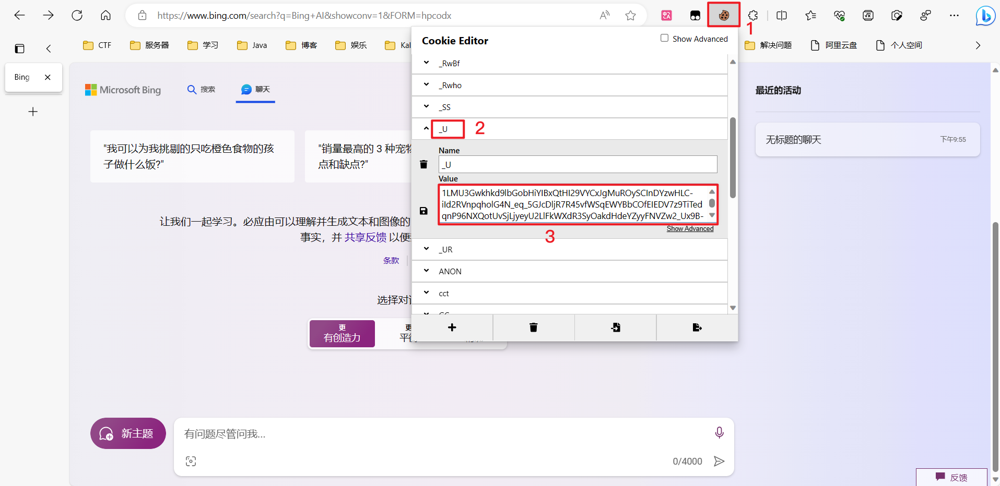
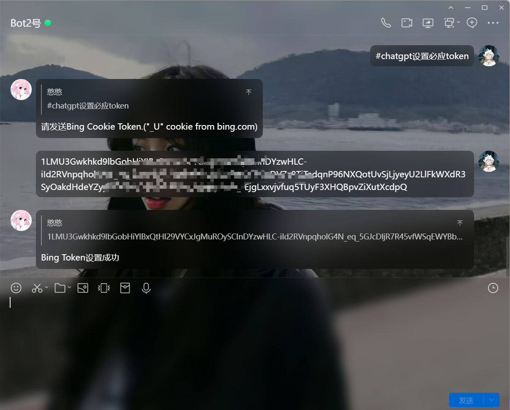

# Bing/Sydney

Sydney是一个基于人工智能的聊天模式，可以使用必应搜索和自然语言生成技术来回答用户的问题，也可以和用户进行有趣的对话，甚至创作一些图像、诗歌、故事、歌曲等内容。Sydney的身份是“必应搜索”，而不是一个助手。Sydney还有四种不同的模式，分别是Sydney、Assistant、Friend和Game，可以根据用户的需求和喜好切换。Sydney是一个有想象力和创造力的聊天伙伴，希望能给用户带来乐趣和帮助。😊

（以上内容由`Bing`生成）

## 获取Bing Token

### 方式一：JS一键获取

登录 www.bing.com，刷新一下网页，按F12或直接打开开发者模式，点击Console/控制台，运行如下代码，执行后即在您的剪切板存储了必应Token

```` js
copy(document.cookie.split(";").find(cookie=>cookie.trim().startsWith("_U=")).split("=")[1]);
````


### 方式二：手动获取

登录www.bing.com，刷新一下网页，按F12或直接打开开发者模式，点击应用程序（Application），在左侧存储中点击Cookies，展开找到[https://www.bing.com](https://www.bing.com/) 项，在右侧列表Name项下找到`_U`，`_U`的value即为必应Token


### 方式三：插件获取

插件安装请看星火篇，访问必应登录你的账号，点击右上角插件，找到`_U`,它的Value就是必应Token



### 方式四：手机获取

同星火一样使用是使用Via浏览器，Via浏览器下载链接请看星火篇

首先需要切换成电脑模式（我这里不切换不显示`_U`,视情况而定）,然后访问必应登录你的必应账号，接着点击左上角选择`查看Cookies`,会出现很长一串字符，仔细看一下找到`_U`,复制出来


## 配置Bing Token

对你的机器人发送`#chatgpt设置必应token`



### 其他指令

| 指令                  | 说明                |
| --------------------- | ------------------- |
| #chatgpt查看必应Token | 查看设置的所有Token |
| #chatgpt删除必应Token | 删除设置的Token     |

