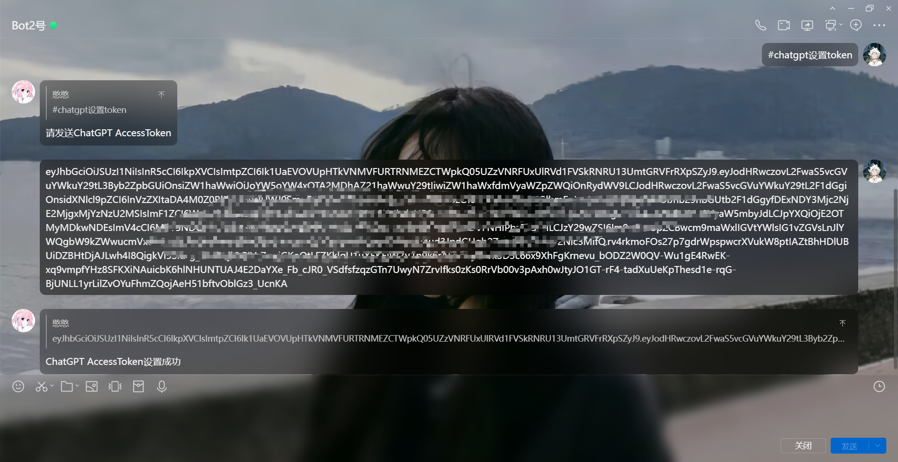

# ChatGPT

ChatGPT是由OpenAI开发的语言模型，具备强大的自然语言处理能力。它基于GPT-3.5架构，拥有广泛的知识储备，能够理解和生成人类语言，进行对话、回答问题、创作文本等任务。ChatGPT能够适应不同的语境，具备与人类类似的交流能力，可用于提供信息、提供建议、进行创意性的文本生成，以及多种其他语言相关的应用领域。无论是教育、娱乐还是专业领域，ChatGPT都展现出强大的语言理解和生成能力，为用户提供丰富多样的语言交互体验。

以下是ChatGPT的主要特点：

1. **自然对话能力：** ChatGPT能够进行自然、流畅的对话，模仿人类交流方式，从而实现更具人性化的交互体验。
2. **广泛的知识：** 它在训练过程中接触了丰富的数据源，包括书籍、文章、互联网内容等，因此具备大量的背景知识，可以回答各种问题。
3. **创造性表达：** 除了回答问题，ChatGPT还能够生成故事、写作、进行推理等，展现出一定程度的创造性和逻辑思维。
4. **多领域应用：** 由于其通用性，ChatGPT可应用于多个领域，如客户服务、教育辅助、创意产生等，为各种任务提供语言支持。

（以上内容由`ChatGPT`生成）

## 获取Access Token

访问 https://chat.openai.com 并登录你的账号（**不登录是获取不了的**），接着再访问 https://chat.openai.com/api/auth/session 会出现下面界面将`Access Token`复制出来备用

## 配置Access Token

对你的机器人发送`#chatgpt设置token`

## 说明

访问（https://chat.openai.com/api/auth/session ）页面之后如果是空的{}，说明没有登录，要登录ChatGPT（ https://chat.openai.com ）而不是OpenAI。

## 相关指令

1. #chat3
2. #chatgpt切换API3
3. #chatgpt设置token
4. #chatgpt清空队列
5. #chatgpt移出队列首位
6. #chatgpt加入对话
7. #chatgpt删除对话
8. #API3结束（全部）对话
