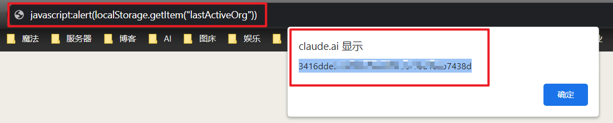
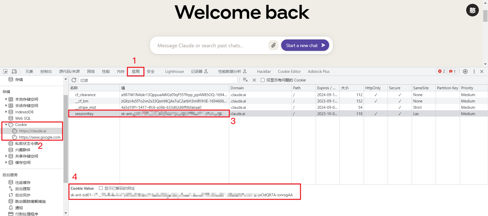

# Claude

# Claude2

## 获取OrganizationId

### 方式一：控制台获取

访问 https://claude.ai 登录你的账号，按下`F12`,点击`控制台（Console）`，复制下面代码并回车，即可获得`OrganizationId`。

````js
localStorage.getItem("lastActiveOrg");
````


### 方式二：地址栏获取

在https://claude.ai 界面的地址栏手动输入`javascript:`复制下面代码粘贴在后面，回车就会出现以下界面（手机操作同理）

````js
alert(localStorage.getItem("lastActiveOrg"))
````



## 获取SessionKey

### 方式一：手动获取

登录账号按`F12`或直接打开开发者模式,点击应用（应用程序，Application），在左侧存储中点击`Cookies`，展开找到https://claude.ai 项，在右侧列表找到`sessionKey`，复制它的值。



### 方式二：插件获取

登录你的账号，点击右上角插件，找到`sessionKey`,它的Value就是`SessionKey`

[获取插件请看星火篇](xinghuo.html#%E6%96%B9%E5%BC%8F%E4%BA%8C-%E4%BD%BF%E7%94%A8cookie-editor%E6%8F%92%E4%BB%B6%E8%8E%B7%E5%8F%96)


### 方式三：手机获取

使用Via浏览器登录账号，按步骤操作即可，[Via浏览器下载链接请看星火篇](xinghuo.html#%E6%96%B9%E5%BC%8F%E4%B8%89-%E6%89%8B%E6%9C%BA%E8%8E%B7%E5%8F%96)


## 获取浏览器指纹和UA

如果用了反代就不需要操作了

使用登录Claude的浏览器访问 https://ja3.zone/check ，如下所示：


## 配置Claude2

登录锅巴，`Ctrl + F`搜索`Claude2`，填写上面获得的信息，填写完成点击保存即可。


