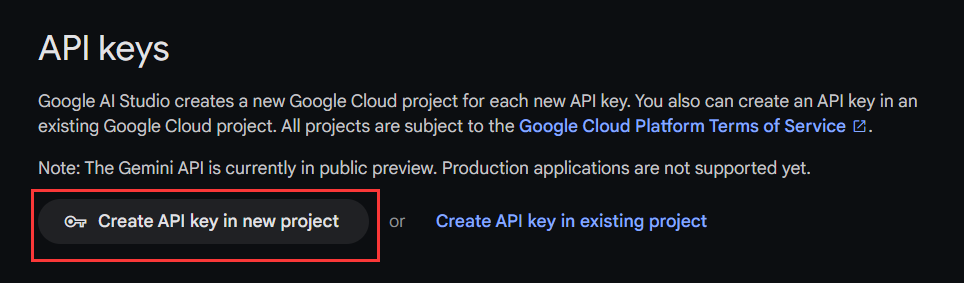

# Gemini Pro

## 获取API Key

Gemini的使用和配置方式非常简单，直接访问[谷歌AI工作室](https://makersuite.google.com/app/apikey)获取免费的API密钥。



## 设置API Key

可通过锅巴后台或者工具箱直接设置，也可以使用指令对机器人进行设置：

```agsl
#chatgpt设置GeminiKey
```

## 使用Gemini Pro
Gemini Pro支持32k上下文，同时支持Function Call，因此支持本插件的智能模式和群聊上下文选项。

虽然Gemini Pro不支持system instruction，但其扮演能力很强，可以直接发送设定，也可以通过插件设定`#chatgpt使用设定xxx`来将设定插入首轮对话。

