# 星火

讯飞星火认知大模型（官网地址：https://xinghuo.xfyun.cn），是科大讯飞研发的以中文为核心的新一代认知智能大模型，我能够在与人自然的对话互动的过程中，同时提供以下多种能力：

1. 内容生成能力：我可以进行多风格多任务长文本生成，例如邮件、文案、公文、作文、对话等；
2. 语言理解能力：我可以进行多层次跨语种语言理解，实现语法检查、要素抽取、语篇归整、文本摘要、情感分析、多语言翻译等；
3. 知识问答能力：我可以回答各种各样的问题，包括生活知识、工作技能、医学知识等；
4. 推理能力：我拥有基于思维链的推理能力，能够进行科学推理、常识推理等；
5. 多题型步骤级数学能力：我具备数学思维，能理解数学问题，覆盖多种题型，并能给出解题步骤。
6. 代码理解与生成能力：我可以进行代码理解、代码修改以及代码生成等工作； 此外，我还具备对话游戏、角色扮演等特色能力，等待你的探索。 我可以对多元能力实现融合统一，对真实场景下的需求，我具备提出问题、规划问题、解决问题的闭环能力。进一步地，我可以持续从海量数据和大规模知识中不断学习进化，这些能力使得我能够在多个行业和领域发挥越来越重要的作用。 同时基于我的能力，我将结合科大讯飞以及行业生态伙伴的相关产品，完成多模态理解和生成等相关工作。

（以上内容由`讯飞星火AI`生成）
## 网页版星火

### 如何获取`ssoSessionId`

#### 方式一：手动获取

访问 https://xinghuo.xfyun.cn/desk?bug=s 并登录你的账号，按下f12按照下面顺序操作

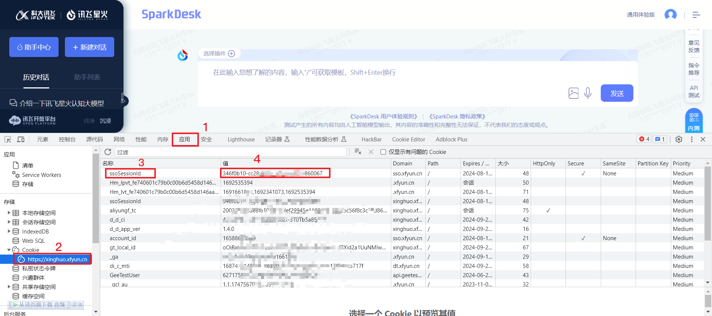

#### 方式二：使用Cookie-Editor插件获取

插件安装地址：

Google Chrome：

https://chrome.google.com/webstore/detail/cookie-editor/hlkenndednhfkekhgcdicdfddnkalmdm?utm_source=ext_sidebar&hl=zh-CN

Edge：

https://microsoftedge.microsoft.com/addons/detail/cookieeditor/neaplmfkghagebokkhpjpoebhdledlfi?hl=zh-CN

安装按下图操作

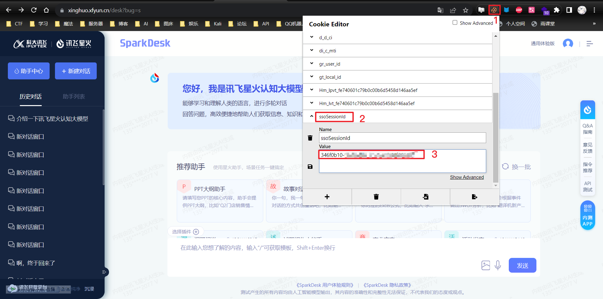

#### 方式三：手机获取

手机需要用到Via浏览器，其他可以获取Cookie的浏览器还有很多，自行查找

Via下载链接：https://www.123pan.com/s/qPtSVv-Lpb5v.html

### 配置ssoSessionId

对你的机器人发送`#chatgpt设置星火token`

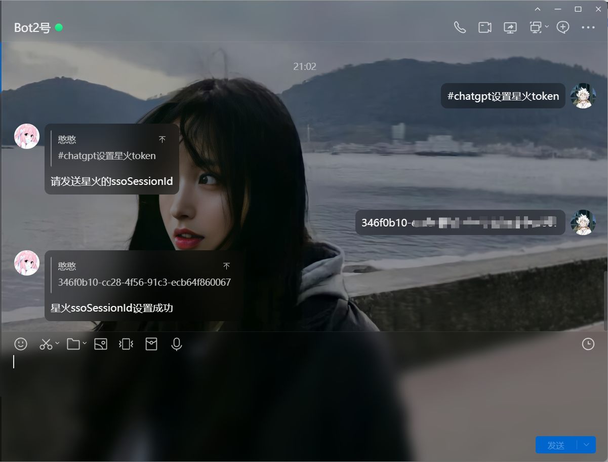

## 星火大模型V1.5/2.0/3.0

### 注册讯飞开放平台账号

1. 注册账号

   访问 https://console.xfyun.cn ，使用手机号验证码登录，按照提示设置密码之后出现以下界面，内容随便选择。

2. 实名认证

   点击上方的`立即实名认证`。

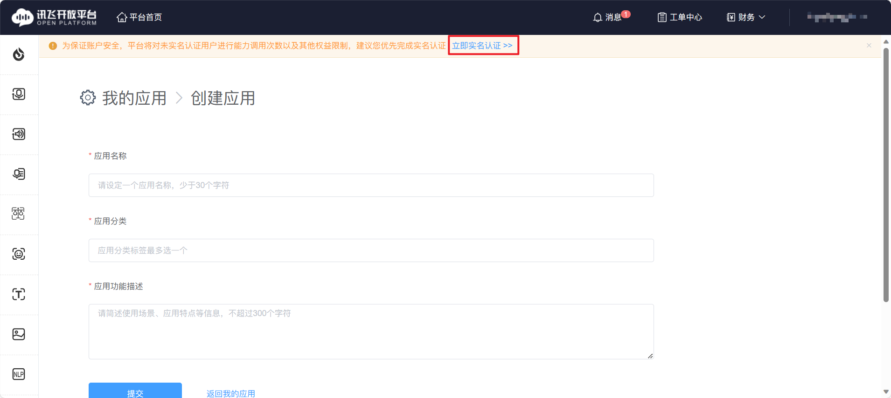

然后点击`个人实名认证`——`立即认证`。

姓名和身份证号这就不用说了，肯定要如实填写的，下面的`所属行业`、`所在地区`、`职业信息`随便填，填写完之后点击`提交认证`。

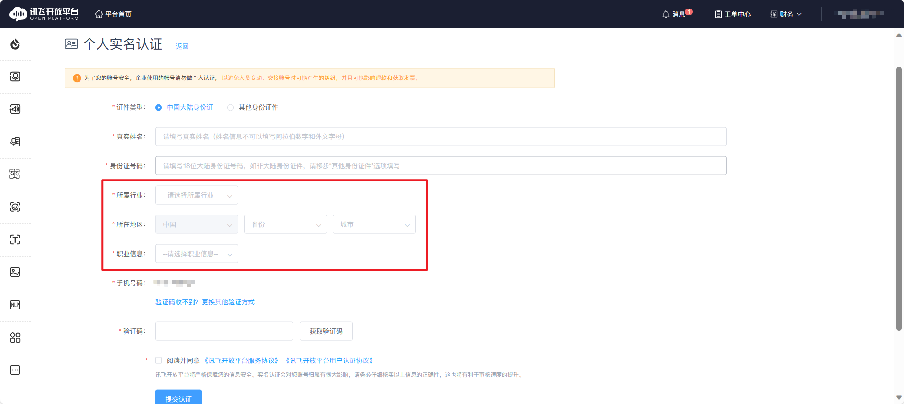

### 申请API

访问 https://xinghuo.xfyun.cn/sparkapi?scr=price ，点击`立即试用`，这里选择V2.0，V1.5、V2.0、V3.0操作一样,有需要也可以申请一下。

选择刚刚创建的应用，套餐默认免费就行，有实力可以付费。

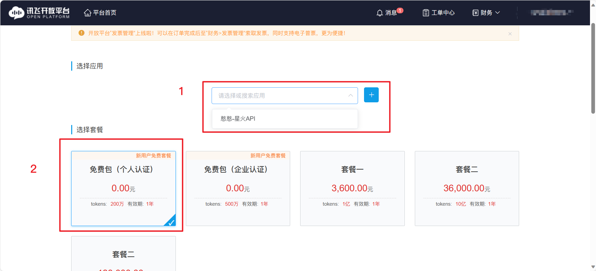

划到最下面点击`确认下单`

这里`确认支付`是灰的，是因为没有设置支付密码，点击链接去设置（如果已经设置请忽略）

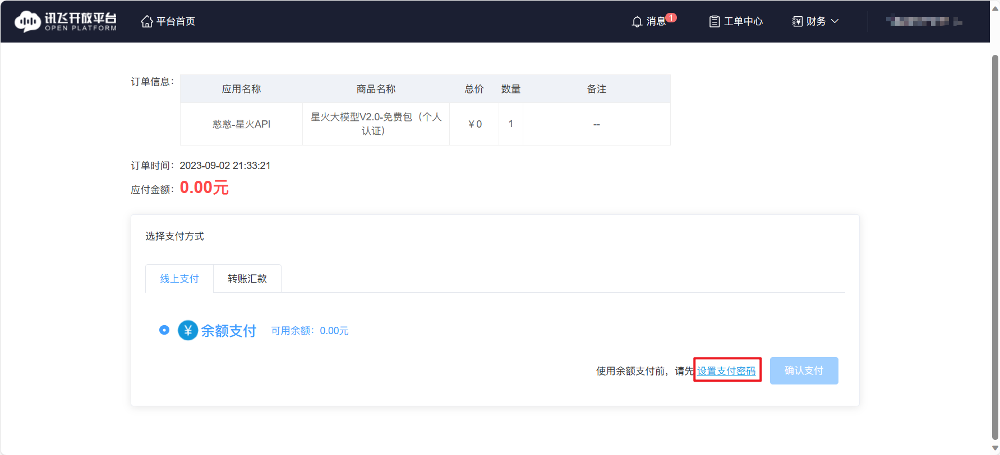

填写支付密码并确认支付

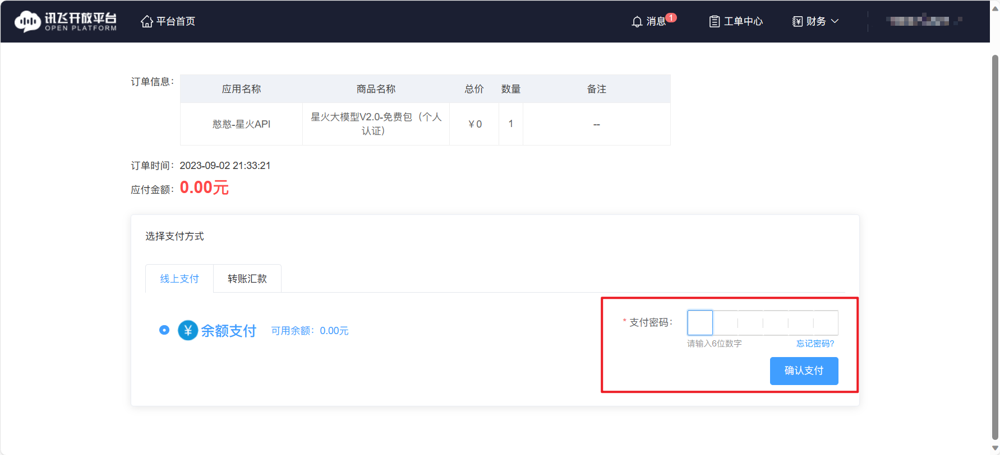

点击左上角`星火认知大模型`，选择`星火大模型V2.0`

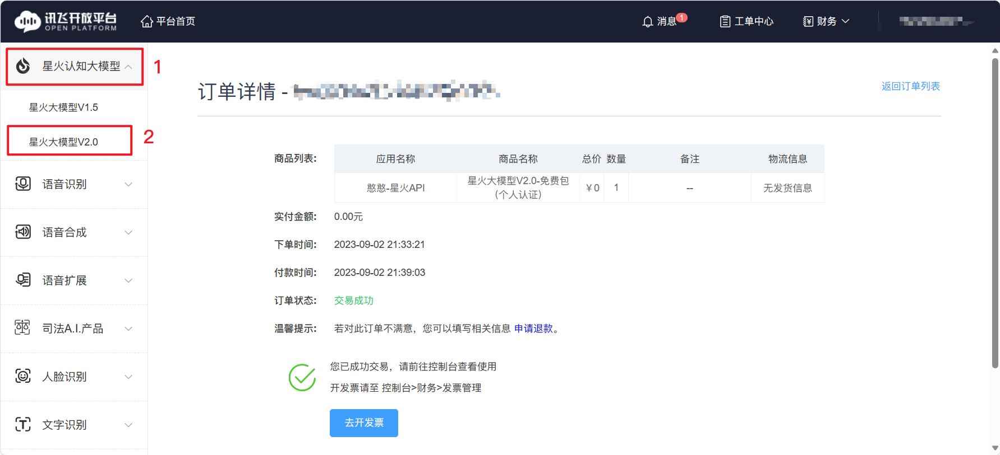

这三个就是我们需要用到的信息，复制备用

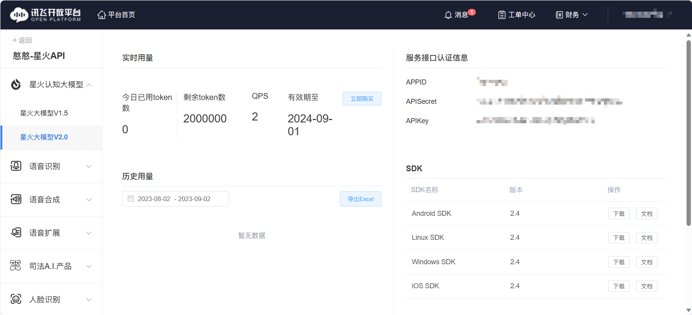

### 配置星火API

#### 方式一：用锅巴

锅巴里找到对应的选项填入即可

#### 方式二：用ChatGPT-Plugin工具箱

PC端建议访问自己的服务器ip加3321端口号进行配置。

访问你的工具箱地址（服务器ip加3321端口）或现成的工具箱地址 https://tools.alcedogroup.com，登录你的账号。如果网页没办法登录，去QQ群：`559567232`的群文件夹下载PC端工具箱（`ChatGPT-Tools`），界面如下：

服务器就是你的服务器ip加3321端口，前提是没有修改端口号。

QQ就是机器人QQ，密码是系统后台密码。新版本工具箱可以直接点击服务器输入框右侧的指纹图标用OTP验证码登录，无需账号和密码。（TRSS等情况受主人账号顺序影响可能没有发送到实际的主人账号，请查看日志）

如果你不知道网址和密码，请往下看

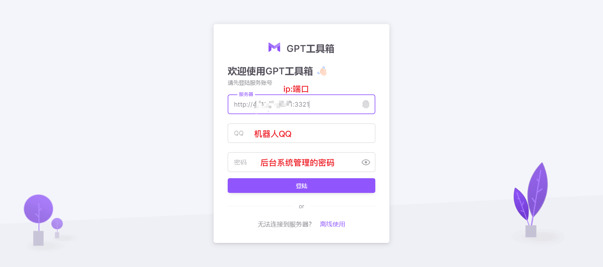

如果你不知道网址和密码或者你忘记了密码又或者没有设置过密码，没有关系，请对你的机器人发送`#chatgpt系统管理`和`#设置管理密码`,红色方框内就是你的服务器地址，可以先复制到浏览器试一下可不可以访问进去，如果访问不了，请去开放一下相应的端口号。

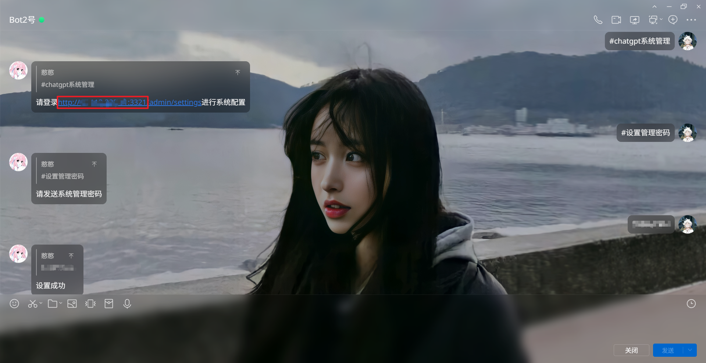

登录上之后，点击左侧的`插件配置`，然后在右侧的模式设置里面找到`星火`，并将刚刚获得的信息对应填进去，这样就可以使用了。

注：星火三个模型使用的是同一套AppID、APISecret、APIKey。所以只需设置一次，以后仅需切换模式。

## 相关指令

1. #xh
2. #chatgpt切换星火
3. #chatgpt设置星火token
4. #chatgpt设置星火模型
5. #星火结束（全部）对话
