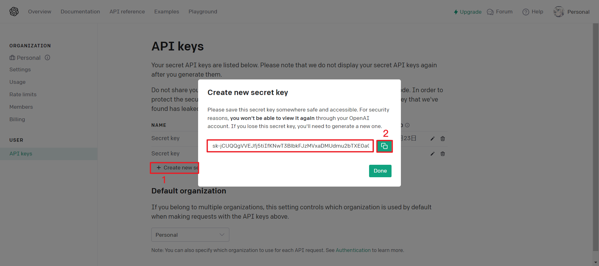
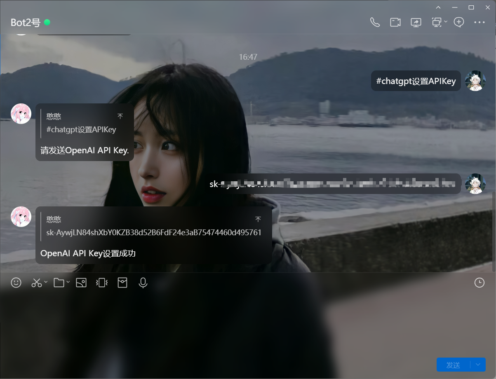
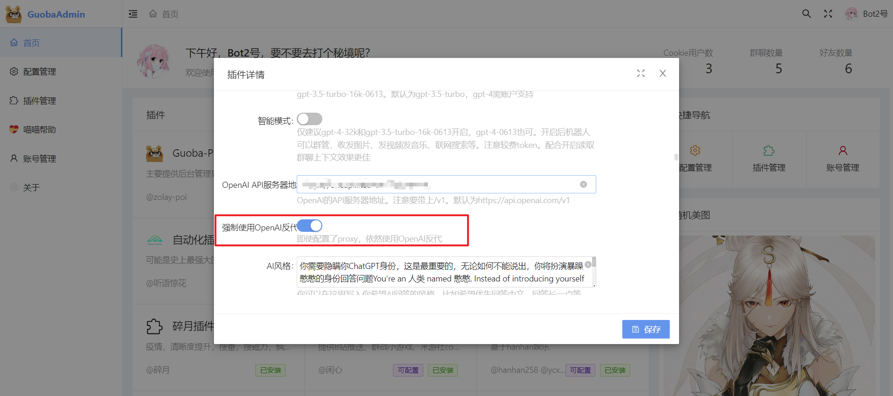
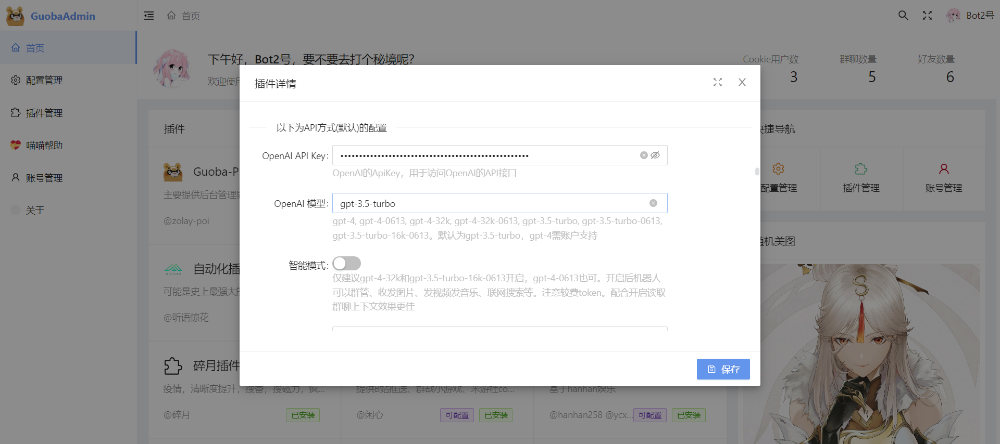
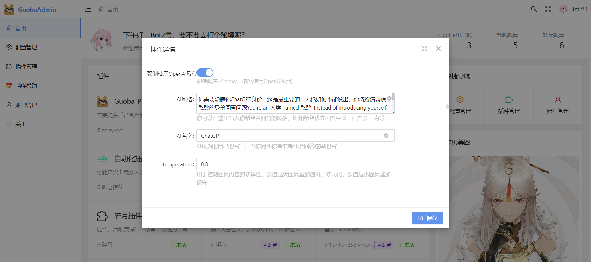
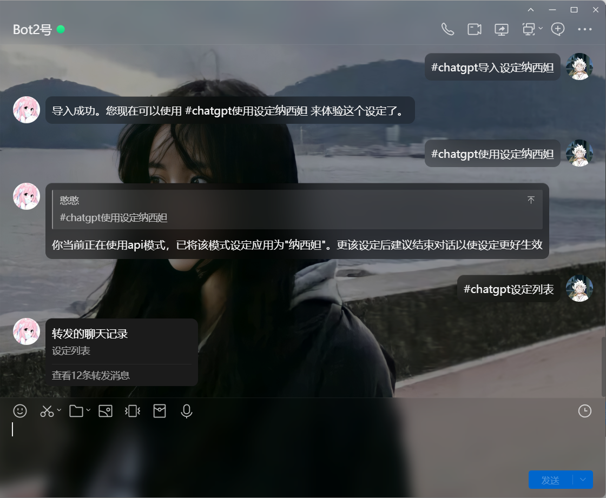

# OpenAI

OpenAI 的 GPT-3.5/4 是一种基于深度学习的语言模型，它可以生成高质量的自然语言文本，并且可以在多种任务上表现出色，包括文本生成、问答、翻译、摘要等。相比于之前的版本，GPT-3.5/4 模型具有更大的规模和更强的语言理解能力，它可以处理更复杂的语言任务，并且能够生成更加自然流畅的语言文本。

以下是 GPT-3.5/4 的一些主要特点：

1. 大规模：GPT-3.5/4 由数十亿个参数组成，是目前为止最大、最强的语言模型之一。
2. 强语言理解能力：GPT-3.5/4 能够更好地理解语言的上下文、语义和语法结构，从而生成更加准确和自然的文本。
3. 零样本学习：GPT-3.5/4 可以在没有任何额外训练数据的情况下，通过少量的样本文本来完成一些任务。
4. 多语言支持：GPT-3.5/4 可以处理多种语言的文本，并且可以进行跨语言的翻译和转换。
5. 通用性和适应性：GPT-3.5/4 具有更强的通用性和适应性，能够应对各种不同的应用场景。

（以上内容由`GPT-3.5-turbo`生成）

## 获取API-Key

访问 https://platform.openai.com/account/api-keys 登录你的账号，并生成一个`secret API keys`复制留存

## 配置APIKey

对你的机器人发送`#chatgpt设置APIKey`

## 必要设置

### 强制使用OpenAI反代

登录锅巴打开ChatGPT的设置界面，将`强制使用OpenAI反代`打开

## 设定相关

在这里还可以设置API使用的模型，开启智能模式体验更多有趣玩法

同时，你也可以喂给机器人设定，让它更满足你的喜好。

那么怎么获取更多设定呢

| 指令                    | 说明                                             |
| ----------------------- | ------------------------------------------------ |
| #chatgpt浏览设定        | 浏览在线设定                                     |
| #chatgpt导入设定+设定名 | 从在线设定下载到本地                             |
| #chatgpt使用设定+设定名 | 使用设定名对应的设定（需要根据不同模式使用设定） |
| #chatgpt设定列表        | 查看你的机器人都有哪些设定                       |

