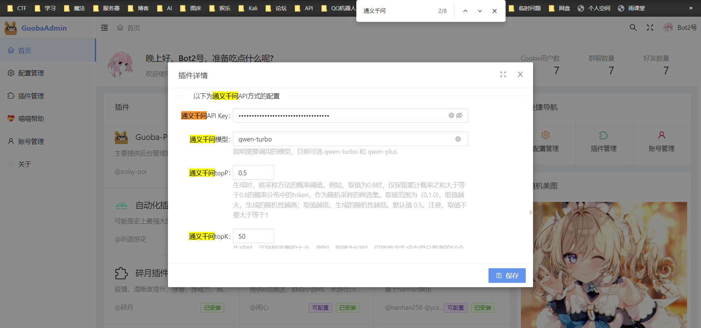

# 通义千问

通义千问是由阿里云开发的一款人工智能助手，具备强大的自然语言处理和机器翻译能力。它拥有广泛的知识储备和精准的理解力，能够对用户的提问进行深入分析，并快速给出准确的答案。无论是日常生活中的常见问题还是专业知识领域的内容，通义千问都能够应对自如，为用户提供高质量的服务。此外，通义千问还具有学习能力，会根据用户的反馈不断优化自身的性能，提高回答的准确性。总之，通义千问是一个高效、智能、全面的语言模型，能够满足不同用户的需求。

（以上内容由`通义千问`生成）

官方文档：https://help.aliyun.com/zh/dashscope/developer-reference/activate-dashscope-and-create-an-api-key

### 开通DashScope灵积模型服务

1. 访问DashScope管理控制台：前往[控制台](https://dashscope.console.aliyun.com/overview)。

   

2. 在“开通服务”项下，点击“去开通”。

   

3. 阅读服务协议，确认无误后点击“立即开通”。

   

### 创建API-KEY

1. 访问DashScope管理控制台API-KEY管理页面：[前往API-KEY管理](https://dashscope.console.aliyun.com/api-key_management)，然后点击“创建新的API-KEY”。

   

2. 点击“创建新的API-KEY”后，系统会创建生成API-KEY，并在弹出的对话框中展示，此处客户可以点击复制按钮将API-KEY的内容复制保存。

   

3. 复制并在安全的地方保存API-KEY后点击“我已保存，关闭”按钮则弹窗关闭，此次创建的API-KEY可立即用于调用DashScope模型服务API，对API-KEY的后续操作均可在当前的API-KEY管理页面进行。

   > **重要**：出于安全考虑，关闭弹窗后，您可以在[API-KEY管理](https://dashscope.console.aliyun.com/api-key_management)通过账号验证的方式再次查看API-KEY。

   

## 配置API-Key

登录锅巴，`Ctrl + F`搜索`通义千问`，填写上面获得的`API-Key`，填写完成点击保存即可。

